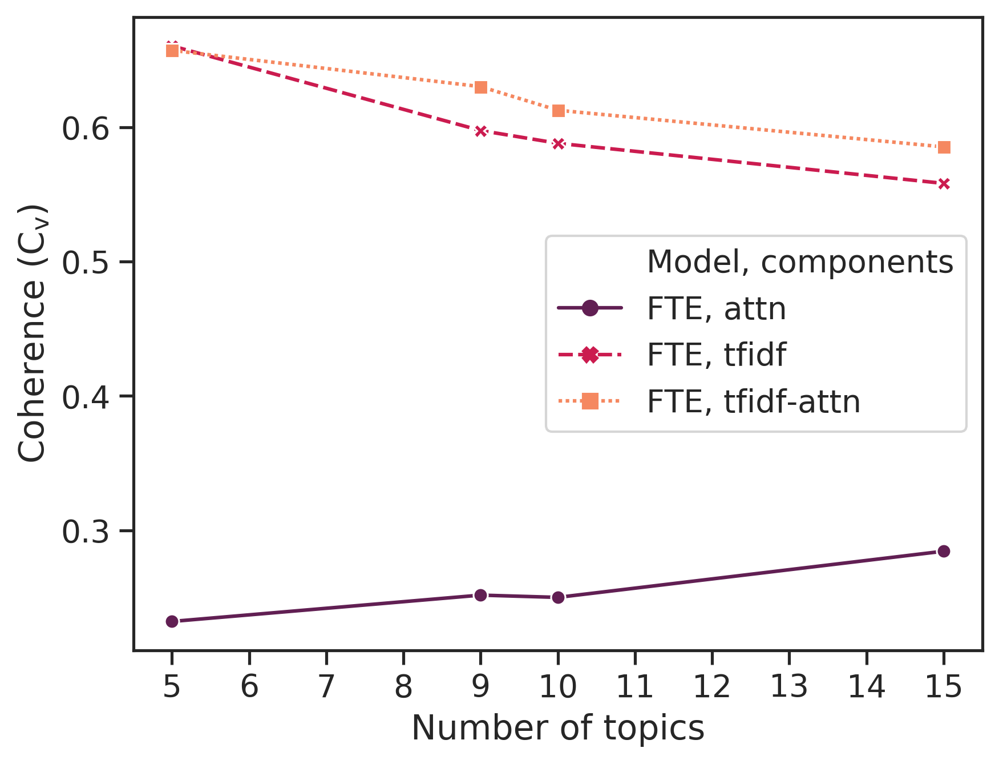

# bert-topics

Topic model for unsupervised learning using embeddings and attention heads from pretrained or fine-tuned BERT classifiers. Works using a modified version of the BertForSequenceClassification module from the transformers package as well as sentence transformers. Some helper functions and functionality forked from [huseinzol05](https://github.com/huseinzol05/NLP-Models-Tensorflow/blob/master/topic-model/2.bert-topic.ipynb "topic-model").

For module documentation, run pydoc. For example:

```bash

pydoc ./model_eval/agreement.py

```

## Download and load embedding models

Explain how to download the embedding model for the paper.

```bash

wget URL_TO_PYTORCH_MODEL

```

## Train topic model

Explain how to train the topic model for the paper.

## Evaluation

Overview of evaluation methods here.

### Coherence

Stuff.

### Model agreement

Model agreement measures the extent to which the label outputs of two (unsupervised) models overlap. 

```bash

python agreement.py

```

### Get best models and output plots



